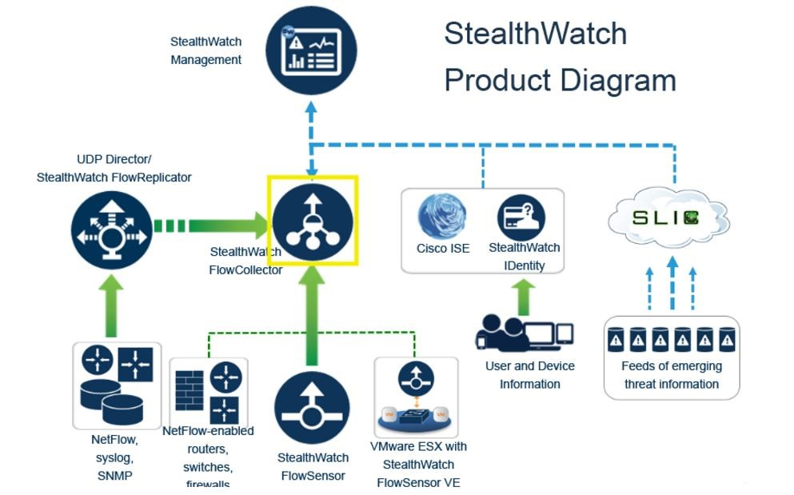

# Cognitive Intelligence Syslog from Stealthwatch Management Console (SMC)
This script will get Cognitive Intelligence incidents from a Stealthwatch Management Console (SMC) and send them as syslog to a specified destination. It is designed to be run as a cronjob, to ensure new alerts and updates are constantly being pushed to the destinations. On the initial run, it will fetch the last 1000 events and record the time the script was run. After that, it will only pull events that are new or modified since the previous run's timestamp.

For more information on the Stealthwatch Enterprise REST API, [please visit](https://developer.cisco.com/docs/stealthwatch/enterprise/)



## Requirements
1. Python 3.x+
    - Additional python modules required, please see [requirements.txt](requirements.txt) for details
2. Stealthwatch Enterprise v7.1.0 or higher
    - Update files and documentation can be found in the Network Visibility and Segementation product category on [software.cisco.com](https://software.cisco.com/download/home/286307082)
3. Stealthwatch user credentials with the "Master Admin" role assigned
    - User roles are configured in the Stealthwatch web interface... simply navigate to `Global Settings -> User Management`

## Installation
1. Ensure Python 3 is installed
   * To download and install Python 3, [please visit](https://www.python.org)
2. Download the files [cognitive-intelligence-syslog.py](cognitive-intelligence-syslog.py) and [requirements.txt](requirements.txt)
3. Install the necessary python modules with the command: `pip install -r requirements.txt`
    * *ensure you use the correct `pip` executable for your instance of Python 3*

## Configuration
The file `env.conf` will be generated upon your first run of the script, and will contain the following fields:
```
[STEALTHWATCH]
SMC = (The IP address of the SMC)
USER = (The username on the SMC to use, with 'Master Admin' role)
PASSWORD = (Encrypted password string [encryption handled on initial config])

[SYSLOG]
DESTINATION = (The IP address to send the UDP syslog to)
PORT = (The port to send the UDP syslog to)
```

#### **Cognitive Intelligence Incidents API Configuration**
The Cognitive Intelligence Incidents REST API is disabled by default. To enable the API:
* Enable Cognitive Analytics in External Services on your SMC and Flow Collector(s)
* For Stealthwatch Enterprise v7.1.x:
    * Locate `/lancope/tomcat/webapps/cta-events-collector/WEB-INF/classes/app.properties` file on your SMC system
    * Under `#CTA_ENABLED` section set the `cta.api.enabled` option to `true`
    * Restart web server on your SMC system: `systemctl restart lc-tomcat`
* For Stealthwatch Enterprise v7.2.0 or newer:
    * Run `cd /lancope/manifests`
    * Locate `docker-compose.prod.yml` file, search for `cta.api.enabled` option and change it to `true`
    * From within same directory run `docker-compose down` and then `docker-compose up -d`

## Usage
1. Identify the path to your Python 3 executible
    * Depending how Python 3 was installed, this might be as simple as just calling the command `python` or `python3`
2. Run the Python script with the following command:
    * `$ <PYTHON-PATH> cognitive-intelligence-syslog.py`
    * Example: `$ /usr/bin/python ./cognitive-intelligence-syslog.py`
3. If running for the first time, enter the request configuration items when prompted
4. This script is designed to be run as a cronjob after the initial run... it caches the previous run's timestamp and only pulls events that are new or have been updated since the last run
    * To schedule a cronjob, run the command `crontab -e` and add a new line containing: `0 0/10 * * * <path-to-python-script>`
    
    More info on [how to use crontab](https://opensource.com/article/17/11/how-use-cron-linux)

## Troubleshooting
A log file will be generated and updated with each run... it will be stored in a `logs` directory in the same directory as the python executable... please reference this log file for troubleshooting

